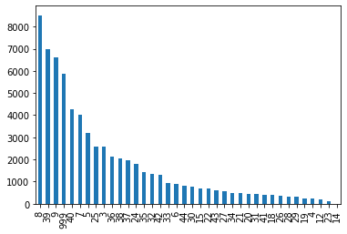
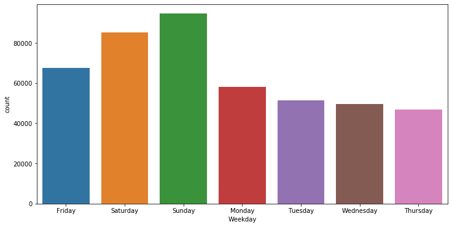
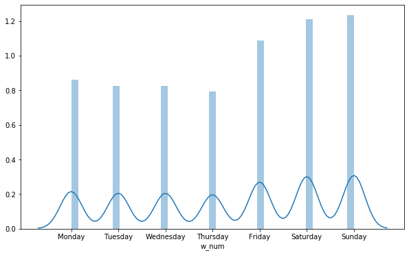
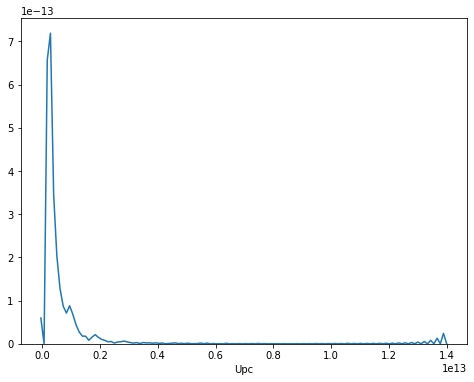

<h1>Table of Contents<span class="tocSkip"></span></h1>
<div class="toc"><ul class="toc-item"><li><span><a href="#Diplodatos-Kaggle-Competition" data-toc-modified-id="Diplodatos-Kaggle-Competition-1"><span class="toc-item-num">1&nbsp;&nbsp;</span>Diplodatos Kaggle Competition</a></span><ul class="toc-item"><li><span><a href="#WEEKDAY" data-toc-modified-id="WEEKDAY-1.1"><span class="toc-item-num">1.1&nbsp;&nbsp;</span>WEEKDAY</a></span></li><li><span><a href="#Feature-creada" data-toc-modified-id="Feature-creada-1.2"><span class="toc-item-num">1.2&nbsp;&nbsp;</span>Feature creada</a></span></li><li><span><a href="#UPC" data-toc-modified-id="UPC-1.3"><span class="toc-item-num">1.3&nbsp;&nbsp;</span>UPC</a></span></li><li><span><a href="#XGBOST" data-toc-modified-id="XGBOST-1.4"><span class="toc-item-num">1.4&nbsp;&nbsp;</span>XGBOST</a></span></li><li><span><a href="#Regresion-Logistica" data-toc-modified-id="Regresion-Logistica-1.5"><span class="toc-item-num">1.5&nbsp;&nbsp;</span>Regresion Logistica</a></span></li><li><span><a href="#Perceptron" data-toc-modified-id="Perceptron-1.6"><span class="toc-item-num">1.6&nbsp;&nbsp;</span>Perceptron</a></span></li><li><span><a href="#SVM" data-toc-modified-id="SVM-1.7"><span class="toc-item-num">1.7&nbsp;&nbsp;</span>SVM</a></span></li><li><span><a href="#NN" data-toc-modified-id="NN-1.8"><span class="toc-item-num">1.8&nbsp;&nbsp;</span>NN</a></span></li><li><span><a href="#Nearest-Centroid" data-toc-modified-id="Nearest-Centroid-1.9"><span class="toc-item-num">1.9&nbsp;&nbsp;</span>Nearest Centroid</a></span></li></ul></li></ul></div>

# Diplodatos Kaggle Competition

We present this peace of code to create the baseline for the competition, and as an example of how to deal with these kind of problems. The main goals are that you:

1. Learn
1. Try different models and see which one fits the best the given data
1. Get a higher score than the given one in the current baseline example
1. Try to get the highest score in the class :)


```python
# Import the required packages
import os

import numpy as np
import pandas as pd
import matplotlib.pyplot as plt
import seaborn as sns

from sklearn.model_selection import train_test_split
from sklearn.metrics import accuracy_score
from sklearn.tree import DecisionTreeClassifier as DT
from sklearn.model_selection import GridSearchCV
from sklearn.linear_model import LogisticRegression
from sklearn.linear_model import Perceptron
from sklearn.svm import LinearSVC
from sklearn.preprocessing import StandardScaler
from sklearn.neighbors import RadiusNeighborsClassifier, KNeighborsClassifier
from sklearn.neighbors import NearestCentroid
```

Read the *original* dataset...


```python
original_df = pd.read_csv('../data/train.csv')
```


```python
original_df.columns
```


    Index(['TripType', 'VisitNumber', 'Weekday', 'Upc', 'ScanCount',
           'DepartmentDescription', 'FinelineNumber'],
          dtype='object')


**TripType** is the column that we should predict. That column is not present in the test set


```python
original_df.describe()
```


<div>
<style scoped>
    .dataframe tbody tr th:only-of-type {
        vertical-align: middle;
    }

    .dataframe tbody tr th {
        vertical-align: top;
    }

    .dataframe thead th {
        text-align: right;
    }
</style>
<table border="1" class="dataframe">
  <thead>
    <tr style="text-align: right;">
      <th></th>
      <th>TripType</th>
      <th>VisitNumber</th>
      <th>Upc</th>
      <th>ScanCount</th>
      <th>FinelineNumber</th>
    </tr>
  </thead>
  <tbody>
    <tr>
      <th>count</th>
      <td>453411.000000</td>
      <td>453411.000000</td>
      <td>4.505590e+05</td>
      <td>453411.000000</td>
      <td>450559.000000</td>
    </tr>
    <tr>
      <th>mean</th>
      <td>58.027039</td>
      <td>95909.846115</td>
      <td>3.075243e+10</td>
      <td>1.108584</td>
      <td>3727.366554</td>
    </tr>
    <tr>
      <th>std</th>
      <td>155.973370</td>
      <td>55399.801147</td>
      <td>9.163940e+10</td>
      <td>0.707029</td>
      <td>2779.958546</td>
    </tr>
    <tr>
      <th>min</th>
      <td>3.000000</td>
      <td>5.000000</td>
      <td>8.340000e+02</td>
      <td>-10.000000</td>
      <td>0.000000</td>
    </tr>
    <tr>
      <th>25%</th>
      <td>27.000000</td>
      <td>49390.000000</td>
      <td>3.400004e+09</td>
      <td>1.000000</td>
      <td>1404.000000</td>
    </tr>
    <tr>
      <th>50%</th>
      <td>39.000000</td>
      <td>96781.000000</td>
      <td>7.056082e+09</td>
      <td>1.000000</td>
      <td>3352.000000</td>
    </tr>
    <tr>
      <th>75%</th>
      <td>40.000000</td>
      <td>143930.000000</td>
      <td>3.013201e+10</td>
      <td>1.000000</td>
      <td>5501.000000</td>
    </tr>
    <tr>
      <th>max</th>
      <td>999.000000</td>
      <td>191347.000000</td>
      <td>9.789707e+11</td>
      <td>71.000000</td>
      <td>9998.000000</td>
    </tr>
  </tbody>
</table>
</div>


```python
original_df.head()
```


<div>
<style scoped>
    .dataframe tbody tr th:only-of-type {
        vertical-align: middle;
    }

    .dataframe tbody tr th {
        vertical-align: top;
    }

    .dataframe thead th {
        text-align: right;
    }
</style>
<table border="1" class="dataframe">
  <thead>
    <tr style="text-align: right;">
      <th></th>
      <th>TripType</th>
      <th>VisitNumber</th>
      <th>Weekday</th>
      <th>Upc</th>
      <th>ScanCount</th>
      <th>DepartmentDescription</th>
      <th>FinelineNumber</th>
    </tr>
  </thead>
  <tbody>
    <tr>
      <th>0</th>
      <td>999</td>
      <td>5</td>
      <td>Friday</td>
      <td>6.811315e+10</td>
      <td>-1</td>
      <td>FINANCIAL SERVICES</td>
      <td>1000.0</td>
    </tr>
    <tr>
      <th>1</th>
      <td>8</td>
      <td>9</td>
      <td>Friday</td>
      <td>1.070081e+09</td>
      <td>1</td>
      <td>IMPULSE MERCHANDISE</td>
      <td>115.0</td>
    </tr>
    <tr>
      <th>2</th>
      <td>8</td>
      <td>9</td>
      <td>Friday</td>
      <td>3.107000e+03</td>
      <td>1</td>
      <td>PRODUCE</td>
      <td>103.0</td>
    </tr>
    <tr>
      <th>3</th>
      <td>8</td>
      <td>9</td>
      <td>Friday</td>
      <td>4.011000e+03</td>
      <td>1</td>
      <td>PRODUCE</td>
      <td>5501.0</td>
    </tr>
    <tr>
      <th>4</th>
      <td>8</td>
      <td>10</td>
      <td>Friday</td>
      <td>6.414410e+09</td>
      <td>1</td>
      <td>DSD GROCERY</td>
      <td>2008.0</td>
    </tr>
  </tbody>
</table>
</div>


Looking into the columns values...


```python
set(original_df.Weekday)
```


    {'Friday', 'Monday', 'Saturday', 'Sunday', 'Thursday', 'Tuesday', 'Wednesday'}


```python
set(original_df.DepartmentDescription)
```


    {'1-HR PHOTO',
     'ACCESSORIES',
     'AUTOMOTIVE',
     'BAKERY',
     'BATH AND SHOWER',
     'BEAUTY',
     'BEDDING',
     'BOOKS AND MAGAZINES',
     'BOYS WEAR',
     'BRAS & SHAPEWEAR',
     'CAMERAS AND SUPPLIES',
     'CANDY, TOBACCO, COOKIES',
     'CELEBRATION',
     'COMM BREAD',
     'CONCEPT STORES',
     'COOK AND DINE',
     'DAIRY',
     'DSD GROCERY',
     'ELECTRONICS',
     'FABRICS AND CRAFTS',
     'FINANCIAL SERVICES',
     'FROZEN FOODS',
     'FURNITURE',
     'GIRLS WEAR, 4-6X  AND 7-14',
     'GROCERY DRY GOODS',
     'HARDWARE',
     'HEALTH AND BEAUTY AIDS',
     'HOME DECOR',
     'HOME MANAGEMENT',
     'HORTICULTURE AND ACCESS',
     'HOUSEHOLD CHEMICALS/SUPP',
     'HOUSEHOLD PAPER GOODS',
     'IMPULSE MERCHANDISE',
     'INFANT APPAREL',
     'INFANT CONSUMABLE HARDLINES',
     'JEWELRY AND SUNGLASSES',
     'LADIES SOCKS',
     'LADIESWEAR',
     'LARGE HOUSEHOLD GOODS',
     'LAWN AND GARDEN',
     'LIQUOR,WINE,BEER',
     'MEAT - FRESH & FROZEN',
     'MEDIA AND GAMING',
     'MENS WEAR',
     'MENSWEAR',
     'OFFICE SUPPLIES',
     'OPTICAL - FRAMES',
     'OPTICAL - LENSES',
     'OTHER DEPARTMENTS',
     'PAINT AND ACCESSORIES',
     'PERSONAL CARE',
     'PETS AND SUPPLIES',
     'PHARMACY OTC',
     'PHARMACY RX',
     'PLAYERS AND ELECTRONICS',
     'PLUS AND MATERNITY',
     'PRE PACKED DELI',
     'PRODUCE',
     'SEAFOOD',
     'SEASONAL',
     'SERVICE DELI',
     'SHEER HOSIERY',
     'SHOES',
     'SLEEPWEAR/FOUNDATIONS',
     'SPORTING GOODS',
     'SWIMWEAR/OUTERWEAR',
     'TOYS',
     'WIRELESS',
     nan}


There are `nan`s in the column, let us find them...


```python
original_df[original_df.DepartmentDescription.isna()]
```


<div>
<style scoped>
    .dataframe tbody tr th:only-of-type {
        vertical-align: middle;
    }

    .dataframe tbody tr th {
        vertical-align: top;
    }

    .dataframe thead th {
        text-align: right;
    }
</style>
<table border="1" class="dataframe">
  <thead>
    <tr style="text-align: right;">
      <th></th>
      <th>TripType</th>
      <th>VisitNumber</th>
      <th>Weekday</th>
      <th>Upc</th>
      <th>ScanCount</th>
      <th>DepartmentDescription</th>
      <th>FinelineNumber</th>
    </tr>
  </thead>
  <tbody>
    <tr>
      <th>739</th>
      <td>999</td>
      <td>484</td>
      <td>Friday</td>
      <td>NaN</td>
      <td>-2</td>
      <td>NaN</td>
      <td>NaN</td>
    </tr>
    <tr>
      <th>740</th>
      <td>999</td>
      <td>484</td>
      <td>Friday</td>
      <td>NaN</td>
      <td>-2</td>
      <td>NaN</td>
      <td>NaN</td>
    </tr>
    <tr>
      <th>1292</th>
      <td>32</td>
      <td>845</td>
      <td>Friday</td>
      <td>NaN</td>
      <td>1</td>
      <td>NaN</td>
      <td>NaN</td>
    </tr>
    <tr>
      <th>1293</th>
      <td>32</td>
      <td>845</td>
      <td>Friday</td>
      <td>NaN</td>
      <td>1</td>
      <td>NaN</td>
      <td>NaN</td>
    </tr>
    <tr>
      <th>1577</th>
      <td>40</td>
      <td>1004</td>
      <td>Friday</td>
      <td>NaN</td>
      <td>1</td>
      <td>NaN</td>
      <td>NaN</td>
    </tr>
    <tr>
      <th>...</th>
      <td>...</td>
      <td>...</td>
      <td>...</td>
      <td>...</td>
      <td>...</td>
      <td>...</td>
      <td>...</td>
    </tr>
    <tr>
      <th>449840</th>
      <td>40</td>
      <td>190133</td>
      <td>Sunday</td>
      <td>NaN</td>
      <td>1</td>
      <td>NaN</td>
      <td>NaN</td>
    </tr>
    <tr>
      <th>450036</th>
      <td>999</td>
      <td>190182</td>
      <td>Sunday</td>
      <td>NaN</td>
      <td>-1</td>
      <td>NaN</td>
      <td>NaN</td>
    </tr>
    <tr>
      <th>450163</th>
      <td>40</td>
      <td>190230</td>
      <td>Sunday</td>
      <td>NaN</td>
      <td>1</td>
      <td>NaN</td>
      <td>NaN</td>
    </tr>
    <tr>
      <th>450361</th>
      <td>39</td>
      <td>190309</td>
      <td>Sunday</td>
      <td>NaN</td>
      <td>1</td>
      <td>NaN</td>
      <td>NaN</td>
    </tr>
    <tr>
      <th>450595</th>
      <td>41</td>
      <td>190408</td>
      <td>Sunday</td>
      <td>NaN</td>
      <td>1</td>
      <td>NaN</td>
      <td>NaN</td>
    </tr>
  </tbody>
</table>
<p>972 rows × 7 columns</p>
</div>


When the description is NaN, then the Upc and FinelineNumber are both NaN?


```python
(original_df.DepartmentDescription.isna().sum(),
 (original_df.DepartmentDescription.isna() & original_df.Upc.isna() & original_df.FinelineNumber.isna()).sum())
```


    (972, 972)


```python
original_df[original_df.Upc.isna()]
```


<div>
<style scoped>
    .dataframe tbody tr th:only-of-type {
        vertical-align: middle;
    }

    .dataframe tbody tr th {
        vertical-align: top;
    }

    .dataframe thead th {
        text-align: right;
    }
</style>
<table border="1" class="dataframe">
  <thead>
    <tr style="text-align: right;">
      <th></th>
      <th>TripType</th>
      <th>VisitNumber</th>
      <th>Weekday</th>
      <th>Upc</th>
      <th>ScanCount</th>
      <th>DepartmentDescription</th>
      <th>FinelineNumber</th>
    </tr>
  </thead>
  <tbody>
    <tr>
      <th>739</th>
      <td>999</td>
      <td>484</td>
      <td>Friday</td>
      <td>NaN</td>
      <td>-2</td>
      <td>NaN</td>
      <td>NaN</td>
    </tr>
    <tr>
      <th>740</th>
      <td>999</td>
      <td>484</td>
      <td>Friday</td>
      <td>NaN</td>
      <td>-2</td>
      <td>NaN</td>
      <td>NaN</td>
    </tr>
    <tr>
      <th>900</th>
      <td>5</td>
      <td>585</td>
      <td>Friday</td>
      <td>NaN</td>
      <td>1</td>
      <td>PHARMACY RX</td>
      <td>NaN</td>
    </tr>
    <tr>
      <th>944</th>
      <td>5</td>
      <td>619</td>
      <td>Friday</td>
      <td>NaN</td>
      <td>1</td>
      <td>PHARMACY RX</td>
      <td>NaN</td>
    </tr>
    <tr>
      <th>945</th>
      <td>5</td>
      <td>619</td>
      <td>Friday</td>
      <td>NaN</td>
      <td>1</td>
      <td>PHARMACY RX</td>
      <td>NaN</td>
    </tr>
    <tr>
      <th>...</th>
      <td>...</td>
      <td>...</td>
      <td>...</td>
      <td>...</td>
      <td>...</td>
      <td>...</td>
      <td>...</td>
    </tr>
    <tr>
      <th>449840</th>
      <td>40</td>
      <td>190133</td>
      <td>Sunday</td>
      <td>NaN</td>
      <td>1</td>
      <td>NaN</td>
      <td>NaN</td>
    </tr>
    <tr>
      <th>450036</th>
      <td>999</td>
      <td>190182</td>
      <td>Sunday</td>
      <td>NaN</td>
      <td>-1</td>
      <td>NaN</td>
      <td>NaN</td>
    </tr>
    <tr>
      <th>450163</th>
      <td>40</td>
      <td>190230</td>
      <td>Sunday</td>
      <td>NaN</td>
      <td>1</td>
      <td>NaN</td>
      <td>NaN</td>
    </tr>
    <tr>
      <th>450361</th>
      <td>39</td>
      <td>190309</td>
      <td>Sunday</td>
      <td>NaN</td>
      <td>1</td>
      <td>NaN</td>
      <td>NaN</td>
    </tr>
    <tr>
      <th>450595</th>
      <td>41</td>
      <td>190408</td>
      <td>Sunday</td>
      <td>NaN</td>
      <td>1</td>
      <td>NaN</td>
      <td>NaN</td>
    </tr>
  </tbody>
</table>
<p>2852 rows × 7 columns</p>
</div>


But it may be the case that Upc is NaN but not the description...


```python
(original_df.Upc.isna().sum(),
 original_df.FinelineNumber.isna().sum(),
 (original_df.FinelineNumber.isna() & original_df.Upc.isna()).sum())
```


    (2852, 2852, 2852)


Upc and FinelineNumber are both NaN at the same time

Our last step in this analysis is to see how balanced is the data...


```python
bins = set(original_df.TripType)
```


```python
# to count the TripType values, we have to group the visits by VisitNumber
original_df.groupby("VisitNumber").TripType.mean().value_counts().plot(kind='bar')
```


    <matplotlib.axes._subplots.AxesSubplot at 0x2b8078ca648>





**Unbalanced!!!**

Create a function to load the datasets.

**Some important decisions made here**:
1. We will use one hot encoding for Weekday and DepartmentDescription. All transformations are applied to the training and testing datasets...
1. We are handling NaN's as another category. This may not be the best approach.
1. We may have multiple records for one single visit and the goal is to classify all those records the exact same way. Therefore, we will prepare the data in a way that all the information for a visit is in the same record.
1. Based on the last bullet, we will count the DepartmentDescription for all items acquired in the same visit.
1. We drop the Upc and FinelineNumber to simplify the process. You may use it as they have a lot of information (may be using one-hot encoding for them as well)

The following operations will be performed in a function. Anyway, we present them here so that we can see them in action:

First, we drop the columns. We include TripType as we are going to treat it differently:


```python
df = original_df.drop(["TripType"], axis=1)
```


```python
df
```


<div>
<style scoped>
    .dataframe tbody tr th:only-of-type {
        vertical-align: middle;
    }

    .dataframe tbody tr th {
        vertical-align: top;
    }

    .dataframe thead th {
        text-align: right;
    }
</style>
<table border="1" class="dataframe">
  <thead>
    <tr style="text-align: right;">
      <th></th>
      <th>VisitNumber</th>
      <th>Weekday</th>
      <th>Upc</th>
      <th>ScanCount</th>
      <th>DepartmentDescription</th>
      <th>FinelineNumber</th>
    </tr>
  </thead>
  <tbody>
    <tr>
      <th>0</th>
      <td>5</td>
      <td>Friday</td>
      <td>6.811315e+10</td>
      <td>-1</td>
      <td>FINANCIAL SERVICES</td>
      <td>1000.0</td>
    </tr>
    <tr>
      <th>1</th>
      <td>9</td>
      <td>Friday</td>
      <td>1.070081e+09</td>
      <td>1</td>
      <td>IMPULSE MERCHANDISE</td>
      <td>115.0</td>
    </tr>
    <tr>
      <th>2</th>
      <td>9</td>
      <td>Friday</td>
      <td>3.107000e+03</td>
      <td>1</td>
      <td>PRODUCE</td>
      <td>103.0</td>
    </tr>
    <tr>
      <th>3</th>
      <td>9</td>
      <td>Friday</td>
      <td>4.011000e+03</td>
      <td>1</td>
      <td>PRODUCE</td>
      <td>5501.0</td>
    </tr>
    <tr>
      <th>4</th>
      <td>10</td>
      <td>Friday</td>
      <td>6.414410e+09</td>
      <td>1</td>
      <td>DSD GROCERY</td>
      <td>2008.0</td>
    </tr>
    <tr>
      <th>...</th>
      <td>...</td>
      <td>...</td>
      <td>...</td>
      <td>...</td>
      <td>...</td>
      <td>...</td>
    </tr>
    <tr>
      <th>453406</th>
      <td>191344</td>
      <td>Sunday</td>
      <td>7.315096e+10</td>
      <td>1</td>
      <td>BEAUTY</td>
      <td>3405.0</td>
    </tr>
    <tr>
      <th>453407</th>
      <td>191344</td>
      <td>Sunday</td>
      <td>6.505300e+10</td>
      <td>1</td>
      <td>WIRELESS</td>
      <td>1712.0</td>
    </tr>
    <tr>
      <th>453408</th>
      <td>191344</td>
      <td>Sunday</td>
      <td>7.918131e+09</td>
      <td>1</td>
      <td>BEAUTY</td>
      <td>3405.0</td>
    </tr>
    <tr>
      <th>453409</th>
      <td>191347</td>
      <td>Sunday</td>
      <td>4.190008e+09</td>
      <td>1</td>
      <td>DAIRY</td>
      <td>1512.0</td>
    </tr>
    <tr>
      <th>453410</th>
      <td>191347</td>
      <td>Sunday</td>
      <td>3.800060e+09</td>
      <td>1</td>
      <td>GROCERY DRY GOODS</td>
      <td>3600.0</td>
    </tr>
  </tbody>
</table>
<p>453411 rows × 6 columns</p>
</div>


```python

```


```python
df.loc[df["ScanCount"] < 0, "Return"] = 1
df.loc[df["Return"] != 1, "Return"] = 0

```


```python
df["Pos_Sum"] = df["ScanCount"]

df.loc[df["Pos_Sum"] < 0, "Pos_Sum"] = 0

```


```python
df["Neg_Sum"] = df["ScanCount"]

df.loc[df["Neg_Sum"] > 0, "Neg_Sum"] = 0

```


```python
df.sample(5)
```


<div>
<style scoped>
    .dataframe tbody tr th:only-of-type {
        vertical-align: middle;
    }

    .dataframe tbody tr th {
        vertical-align: top;
    }

    .dataframe thead th {
        text-align: right;
    }
</style>
<table border="1" class="dataframe">
  <thead>
    <tr style="text-align: right;">
      <th></th>
      <th>VisitNumber</th>
      <th>Weekday</th>
      <th>Upc</th>
      <th>ScanCount</th>
      <th>DepartmentDescription</th>
      <th>FinelineNumber</th>
      <th>Return</th>
      <th>Pos_Sum</th>
      <th>Neg_Sum</th>
    </tr>
  </thead>
  <tbody>
    <tr>
      <th>274788</th>
      <td>115261</td>
      <td>Tuesday</td>
      <td>2.100005e+09</td>
      <td>1</td>
      <td>GROCERY DRY GOODS</td>
      <td>3201.0</td>
      <td>0.0</td>
      <td>1</td>
      <td>0</td>
    </tr>
    <tr>
      <th>276300</th>
      <td>115984</td>
      <td>Tuesday</td>
      <td>9.100010e+08</td>
      <td>1</td>
      <td>AUTOMOTIVE</td>
      <td>1006.0</td>
      <td>0.0</td>
      <td>1</td>
      <td>0</td>
    </tr>
    <tr>
      <th>295678</th>
      <td>124651</td>
      <td>Wednesday</td>
      <td>7.192105e+09</td>
      <td>1</td>
      <td>FROZEN FOODS</td>
      <td>9117.0</td>
      <td>0.0</td>
      <td>1</td>
      <td>0</td>
    </tr>
    <tr>
      <th>233592</th>
      <td>99276</td>
      <td>Saturday</td>
      <td>NaN</td>
      <td>1</td>
      <td>NaN</td>
      <td>NaN</td>
      <td>0.0</td>
      <td>1</td>
      <td>0</td>
    </tr>
    <tr>
      <th>227354</th>
      <td>97033</td>
      <td>Saturday</td>
      <td>8.500002e+09</td>
      <td>-1</td>
      <td>LIQUOR,WINE,BEER</td>
      <td>2300.0</td>
      <td>1.0</td>
      <td>0</td>
      <td>-1</td>
    </tr>
  </tbody>
</table>
</div>


## WEEKDAY


```python
plt.figure(figsize=(12,6))
sns.countplot(df.Weekday)
```


    <matplotlib.axes._subplots.AxesSubplot at 0x2b809e13648>





```python
df.groupby('Weekday')['Weekday'].count()
```


    Weekday
    Friday       67525
    Monday       58139
    Saturday     85356
    Sunday       94602
    Thursday     46803
    Tuesday      51463
    Wednesday    49523
    Name: Weekday, dtype: int64


Now, we create the dummy columns


```python
df = pd.get_dummies(df, columns=["DepartmentDescription"], dummy_na=True)
```


```python
df
```


<div>
<style scoped>
    .dataframe tbody tr th:only-of-type {
        vertical-align: middle;
    }

    .dataframe tbody tr th {
        vertical-align: top;
    }

    .dataframe thead th {
        text-align: right;
    }
</style>
<table border="1" class="dataframe">
  <thead>
    <tr style="text-align: right;">
      <th></th>
      <th>VisitNumber</th>
      <th>Weekday</th>
      <th>Upc</th>
      <th>ScanCount</th>
      <th>FinelineNumber</th>
      <th>Return</th>
      <th>Pos_Sum</th>
      <th>Neg_Sum</th>
      <th>DepartmentDescription_1-HR PHOTO</th>
      <th>DepartmentDescription_ACCESSORIES</th>
      <th>...</th>
      <th>DepartmentDescription_SEASONAL</th>
      <th>DepartmentDescription_SERVICE DELI</th>
      <th>DepartmentDescription_SHEER HOSIERY</th>
      <th>DepartmentDescription_SHOES</th>
      <th>DepartmentDescription_SLEEPWEAR/FOUNDATIONS</th>
      <th>DepartmentDescription_SPORTING GOODS</th>
      <th>DepartmentDescription_SWIMWEAR/OUTERWEAR</th>
      <th>DepartmentDescription_TOYS</th>
      <th>DepartmentDescription_WIRELESS</th>
      <th>DepartmentDescription_nan</th>
    </tr>
  </thead>
  <tbody>
    <tr>
      <th>0</th>
      <td>5</td>
      <td>Friday</td>
      <td>6.811315e+10</td>
      <td>-1</td>
      <td>1000.0</td>
      <td>1.0</td>
      <td>0</td>
      <td>-1</td>
      <td>0</td>
      <td>0</td>
      <td>...</td>
      <td>0</td>
      <td>0</td>
      <td>0</td>
      <td>0</td>
      <td>0</td>
      <td>0</td>
      <td>0</td>
      <td>0</td>
      <td>0</td>
      <td>0</td>
    </tr>
    <tr>
      <th>1</th>
      <td>9</td>
      <td>Friday</td>
      <td>1.070081e+09</td>
      <td>1</td>
      <td>115.0</td>
      <td>0.0</td>
      <td>1</td>
      <td>0</td>
      <td>0</td>
      <td>0</td>
      <td>...</td>
      <td>0</td>
      <td>0</td>
      <td>0</td>
      <td>0</td>
      <td>0</td>
      <td>0</td>
      <td>0</td>
      <td>0</td>
      <td>0</td>
      <td>0</td>
    </tr>
    <tr>
      <th>2</th>
      <td>9</td>
      <td>Friday</td>
      <td>3.107000e+03</td>
      <td>1</td>
      <td>103.0</td>
      <td>0.0</td>
      <td>1</td>
      <td>0</td>
      <td>0</td>
      <td>0</td>
      <td>...</td>
      <td>0</td>
      <td>0</td>
      <td>0</td>
      <td>0</td>
      <td>0</td>
      <td>0</td>
      <td>0</td>
      <td>0</td>
      <td>0</td>
      <td>0</td>
    </tr>
    <tr>
      <th>3</th>
      <td>9</td>
      <td>Friday</td>
      <td>4.011000e+03</td>
      <td>1</td>
      <td>5501.0</td>
      <td>0.0</td>
      <td>1</td>
      <td>0</td>
      <td>0</td>
      <td>0</td>
      <td>...</td>
      <td>0</td>
      <td>0</td>
      <td>0</td>
      <td>0</td>
      <td>0</td>
      <td>0</td>
      <td>0</td>
      <td>0</td>
      <td>0</td>
      <td>0</td>
    </tr>
    <tr>
      <th>4</th>
      <td>10</td>
      <td>Friday</td>
      <td>6.414410e+09</td>
      <td>1</td>
      <td>2008.0</td>
      <td>0.0</td>
      <td>1</td>
      <td>0</td>
      <td>0</td>
      <td>0</td>
      <td>...</td>
      <td>0</td>
      <td>0</td>
      <td>0</td>
      <td>0</td>
      <td>0</td>
      <td>0</td>
      <td>0</td>
      <td>0</td>
      <td>0</td>
      <td>0</td>
    </tr>
    <tr>
      <th>...</th>
      <td>...</td>
      <td>...</td>
      <td>...</td>
      <td>...</td>
      <td>...</td>
      <td>...</td>
      <td>...</td>
      <td>...</td>
      <td>...</td>
      <td>...</td>
      <td>...</td>
      <td>...</td>
      <td>...</td>
      <td>...</td>
      <td>...</td>
      <td>...</td>
      <td>...</td>
      <td>...</td>
      <td>...</td>
      <td>...</td>
      <td>...</td>
    </tr>
    <tr>
      <th>453406</th>
      <td>191344</td>
      <td>Sunday</td>
      <td>7.315096e+10</td>
      <td>1</td>
      <td>3405.0</td>
      <td>0.0</td>
      <td>1</td>
      <td>0</td>
      <td>0</td>
      <td>0</td>
      <td>...</td>
      <td>0</td>
      <td>0</td>
      <td>0</td>
      <td>0</td>
      <td>0</td>
      <td>0</td>
      <td>0</td>
      <td>0</td>
      <td>0</td>
      <td>0</td>
    </tr>
    <tr>
      <th>453407</th>
      <td>191344</td>
      <td>Sunday</td>
      <td>6.505300e+10</td>
      <td>1</td>
      <td>1712.0</td>
      <td>0.0</td>
      <td>1</td>
      <td>0</td>
      <td>0</td>
      <td>0</td>
      <td>...</td>
      <td>0</td>
      <td>0</td>
      <td>0</td>
      <td>0</td>
      <td>0</td>
      <td>0</td>
      <td>0</td>
      <td>0</td>
      <td>1</td>
      <td>0</td>
    </tr>
    <tr>
      <th>453408</th>
      <td>191344</td>
      <td>Sunday</td>
      <td>7.918131e+09</td>
      <td>1</td>
      <td>3405.0</td>
      <td>0.0</td>
      <td>1</td>
      <td>0</td>
      <td>0</td>
      <td>0</td>
      <td>...</td>
      <td>0</td>
      <td>0</td>
      <td>0</td>
      <td>0</td>
      <td>0</td>
      <td>0</td>
      <td>0</td>
      <td>0</td>
      <td>0</td>
      <td>0</td>
    </tr>
    <tr>
      <th>453409</th>
      <td>191347</td>
      <td>Sunday</td>
      <td>4.190008e+09</td>
      <td>1</td>
      <td>1512.0</td>
      <td>0.0</td>
      <td>1</td>
      <td>0</td>
      <td>0</td>
      <td>0</td>
      <td>...</td>
      <td>0</td>
      <td>0</td>
      <td>0</td>
      <td>0</td>
      <td>0</td>
      <td>0</td>
      <td>0</td>
      <td>0</td>
      <td>0</td>
      <td>0</td>
    </tr>
    <tr>
      <th>453410</th>
      <td>191347</td>
      <td>Sunday</td>
      <td>3.800060e+09</td>
      <td>1</td>
      <td>3600.0</td>
      <td>0.0</td>
      <td>1</td>
      <td>0</td>
      <td>0</td>
      <td>0</td>
      <td>...</td>
      <td>0</td>
      <td>0</td>
      <td>0</td>
      <td>0</td>
      <td>0</td>
      <td>0</td>
      <td>0</td>
      <td>0</td>
      <td>0</td>
      <td>0</td>
    </tr>
  </tbody>
</table>
<p>453411 rows × 77 columns</p>
</div>


Now, we group by the VisitNumber and Weekday (they should be the same), and add all values for ScanCount, and the one-hot encoding of DepartmentDescriptioin


```python
df = df.groupby(["VisitNumber", "Weekday"], as_index=False).sum()
```


```python
def week(x):
  if x=='Monday':
    return 0
  elif x=='Tuesday':
    return 1
  elif x=='Wednesday':
    return 2
  elif x=='Thursday':
    return 3
  elif x=='Friday':
    return 4
  elif x=='Saturday':
    return 5
  elif x=='Sunday':
    return 6 
```


```python
df['w_num']=df.Weekday.apply(week)
```


```python
fig,axs=plt.subplots(figsize=(10,6))
sns.distplot(df['w_num'],ax=axs)
ticks=list(range(0,7))
axs.set_xticks(ticks)
x_tick_label=['Monday','Tuesday','Wednesday','Thursday','Friday','Saturday','Sunday']
axs.set_xticklabels(x_tick_label)
plt.show()
```





## Feature creada


```python
#prod_porvisita=df.groupby(['VisitNumber'])['Upc'].count()
#prod_porvisita
```


```python
#prod_porvisita_dict=dict(prod_porvisita)

```


```python
#df['num_of_products_for_VisitNumber']=df['VisitNumber'].apply(lambda x:prod_porvisita_dict.get(x,0))
```


```python
#df.num_of_products_for_VisitNumber.nunique()
```


```python
#plt.figure(figsize=(12,6))
#sns.distplot(df.num_of_products_for_VisitNumber,bins=99)
```

## UPC


```python
plt.figure(figsize=(8,6))
sns.distplot(df.Upc,hist=False)
```


    <matplotlib.axes._subplots.AxesSubplot at 0x2b809f78908>





```python
def float_to_str(obj):
    """
    Convert Upc code from float to string
    Use this function by applying lambda
    :param obj: "Upc" column of DataFrame
    :return: string converted Upc removing dot.
    """
    while obj != "nan":
        obj = str(obj).split(".")[0]
        return obj
```


```python

def company(x):
    """
    Return company code from given Upc code.
    :param x: "Upc" column of DataFrame
    :return: company code
    """
    try:
        p = x[:6]
        if p == "000000":
            return x[-5]
        return p
    except:
        return -9999
```


```python
df["Upc"] = df.Upc.apply(float_to_str)

df["company"] = df.Upc.apply(company) 

```


```python
def transform_data(train_data_fname, test_data_fname):
    df_train = pd.read_csv(train_data_fname)
    df_train['is_train_set'] = 1
    df_test = pd.read_csv(test_data_fname)
    df_test['is_train_set'] = 0

    # we  get the TripType for the train set. To do that, we group by VisitNumber and
    # then we get the max (or min or avg)
    y = df_train.groupby(["VisitNumber", "Weekday"], as_index=False).max().TripType

    # we remove the TripType now, and concat training and testing data
    # the concat is done so that we have the same columns for both datasets
    # after one-hot encoding
    df_train = df_train.drop("TripType", axis=1)
    df = pd.concat([df_train, df_test])
    
    # the next three operations are the ones we have just presented in the previous lines
    
    # drop the columns we won't use (it may be good to use them somehow)
    df = df.drop([ "FinelineNumber"], axis=1)

    # one-hot encoding for the DepartmentDescription
    df = pd.get_dummies(df, columns=["DepartmentDescription"], dummy_na=True)

    # now we add the groupby values
    df = df.groupby(["VisitNumber", "Weekday"], as_index=False).sum()
    
    # finally, we do one-hot encoding for the Weekday
    df = pd.get_dummies(df, columns=["Weekday"], dummy_na=True)
    
    #df = pd.get_dummies(df, columns=["Return"], dummy_na=True)

    # get train and test back
    df_train = df[df.is_train_set != 0]
    df_test = df[df.is_train_set == 0]
    
    X = df_train.drop(["is_train_set"], axis=1)
    yy = None
    XX = df_test.drop(["is_train_set"], axis=1)

    return X, y, XX, yy
```

Load the data...


```python
X, y, XX, yy = transform_data("../data/train.csv", "../data/test.csv")
```

Create the model and evaluate it


```python
# split training dataset into train and "validation" 
# (we won't be using validation set in this example, because of the cross-validation;
# but it could be useful for you depending on your approach)
from sklearn.model_selection import train_test_split
X_train, X_valid, y_train, y_valid = train_test_split(X, y, test_size=0.3, random_state=42)
```


```python
# results dataframe is used to store the computed results
results = pd.DataFrame(columns=('clf', 'best_acc'))
```


```python
from sklearn.model_selection import GridSearchCV
from sklearn.metrics import accuracy_score
from sklearn.ensemble import RandomForestClassifier
```


```python
rfc=RandomForestClassifier(random_state=42)

param_grid = { 
    'n_estimators': [1, 100],
    'criterion' :['gini', 'entropy']
}

rfc_clf = GridSearchCV(rfc, param_grid, cv=3, scoring='accuracy')
rfc_clf.fit(X_train, y_train)
best_rfc_clf = rfc_clf.best_estimator_
```


```python
print('Best RF accuracy: ', rfc_clf.best_score_)
print(best_rfc_clf)
results = results.append({'clf': best_rfc_clf, 'best_acc': rfc_clf.best_score_}, ignore_index=True)

print('The best classifier so far is: ')
print(results.loc[results['best_acc'].idxmax()]['clf'])
```

    Best RF accuracy:  0.6757033248081842
    RandomForestClassifier(random_state=42)
    The best classifier so far is: 
    RandomForestClassifier(random_state=42)
    

**And finally**, we predict the unknown label for the testing set


```python
yy_predict = results.loc[results['best_acc'].idxmax()]['clf'].predict(X_valid)
```


```python
print(results.loc[results['best_acc'].idxmax()]['clf'])
print(accuracy_score(y_valid, yy_predict))
```

    RandomForestClassifier(random_state=42)
    0.6820826495598985
    


```python
X.shape, XX.shape
```


    ((67029, 80), (28645, 80))


```python
yy = results.clf.iloc[0].predict(XX)
```

The last thing we do is generating a file that should be *submitted* on kaggle


```python
submission = pd.DataFrame(list(zip(XX.VisitNumber, yy)), columns=["VisitNumber", "TripType"])
```


```python
submission.to_csv("../data/submission.csv", header=True, index=False)
```

## XGBOST

import xgboost as xgb
from sklearn.model_selection import train_test_split
from sklearn.preprocessing import LabelEncoder
dtrain = xgb.DMatrix(X_train.values, label=y_train)
dtest = xgb.DMatrix(X_valid.values, label=y_valid)num_boost_round = 300
params = {'objective':'multi:softprob', 
          'eval_metric': 'mlogloss',
          'num_class':37, 
          'max_delta_step': 3, 
          'eta': 0.2}
evals = [(dtrain, 'train'), (dtest, 'eval')]

bst = xgb.train(params=params,  
                dtrain=dtrain, 
                num_boost_round=num_boost_round, 
                evals=evals,
                early_stopping_rounds=10,)from sklearn.metrics import log_loss
my_test = xgb.DMatrix(X_valid.values)
test_predictions = bst.predict(my_test)
print("log loss :", log_loss(y_valid, test_predictions).round(5))
## Regresion Logistica
log_regr_param = {'C':(1e+4, 1e+3, 1e+2),
                  'solver':('newton-cg', 'lbfgs', 'liblinear', 'sag', 'saga'),
                  'max_iter':(5, 20, 100)}

log_regr = LogisticRegression(random_state=42)
log_reg_clf = GridSearchCV(log_regr, log_regr_param, scoring='accuracy', cv=3, iid=False, n_jobs=-1)
log_reg_clf.fit(X_train, y_train)
best_log_reg_clf = log_reg_clf.best_estimator_
print('Best Logistic Regression accuracy: ', log_reg_clf.best_score_)
print(best_log_reg_clf)
results = results.append({'clf': best_log_reg_clf, 'best_acc': log_reg_clf.best_score_}, ignore_index=True)

print('The best classifier so far is: ')
print(results.loc[results['best_acc'].idxmax()]['clf'])
## Perceptron
perceptron_param = {'shuffle':(True, False),
                  'random_state':(1, 10, 20, 30, 40, 50, 100),
                  'max_iter':(5, 20, 100, 1000, 2000)}

perceptron = Perceptron()
perceptron_clf = GridSearchCV(perceptron, perceptron_param, scoring='accuracy', cv=3, iid=False, n_jobs=-1)
perceptron_clf.fit(X_train, y_train)
best_perceptron_clf = perceptron_clf.best_estimator_
print('Best Perceptron accuracy: ', perceptron_clf.best_score_)
print(best_perceptron_clf)
results = results.append({'clf': best_perceptron_clf, 'best_acc': perceptron_clf.best_score_}, ignore_index=True)

print('The best classifier so far is: ')
print(results.loc[results['best_acc'].idxmax()]['clf'])
## SVM
svm_param = {'loss':('hinge', 'squared_hinge'),
             'dual':(True, False),
             'C':(1e+3, 1e+2, 1e+1, 1),
             'tol':(1e-3, 1e-4, 1e-5),
             'random_state':(1, 10, 20, 30),
             'max_iter':(5, 20, 100)}

svm = LinearSVC()
svm_clf = GridSearchCV(svm, svm_param, scoring='accuracy', cv=3, iid=False, n_jobs=-1, error_score=0.0)
svm_clf.fit(X_train, y_train)
best_svm_clf = svm_clf.best_estimator_
print('Best SVM accuracy: ', svm_clf.best_score_)
print(best_svm_clf)
results = results.append({'clf': best_svm_clf, 'best_acc': svm_clf.best_score_}, ignore_index=True)

print('The best classifier so far is: ')
print(results.loc[results['best_acc'].idxmax()]['clf'])
## NN
knn_param = {'n_neighbors':(3, 4, 5, 6),
             'weights':('uniform', 'distance'),
             'algorithm':('auto', 'ball_tree', 'kd_tree', 'brute'),
             'leaf_size':(15, 30, 60),
             'p':(1, 2)}

knn = KNeighborsClassifier()
knn_clf = GridSearchCV(knn, knn_param, scoring='accuracy', cv=3, iid=False, n_jobs=-1, error_score=0.0)
knn_clf.fit(X_train, y_train)
best_knn_clf = knn_clf.best_estimator_
print('Best KNN accuracy: ', knn_clf.best_score_)
print(best_knn_clf)
results = results.append({'clf': best_knn_clf, 'best_acc': knn_clf.best_score_}, ignore_index=True)

print('The best classifier so far is: ')
print(results.loc[results['best_acc'].idxmax()]['clf'])
## Nearest Centroid
nc_param = {'metric': ['euclidean', 'manhattan', 'cityblock', 'cosine', 'l1', 'l2'], 
            'shrink_threshold': [None, 1e+3, 1e+2, 1e+1, 1, 1e-3, 1e-2, 1e-1] }

nc = NearestCentroid()
nc_clf = GridSearchCV(nc, nc_param, scoring='accuracy', cv=3, iid=False, n_jobs=-1, error_score=0.0)
nc_clf.fit(X_train, y_train)
best_nc_clf = nc_clf.best_estimator_
print('Best SVM accuracy: ', nc_clf.best_score_)
print(best_nc_clf)
results = results.append({'clf': best_nc_clf, 'best_acc': nc_clf.best_score_}, ignore_index=True)

print('The best classifier so far is: ')
print(results.loc[results['best_acc'].idxmax()]['clf'])
GRUPO 11 - Nazareno Medrano,Cristian Salgado,David Veisaga,Fernado Apaza
